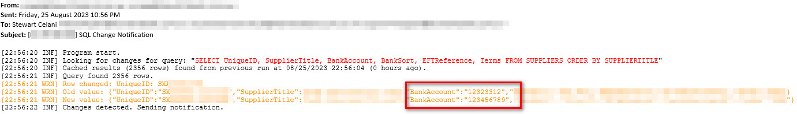

# Simple SQL Change Notifications

Some simple code to monitor a SQL query and send an email when the results change.

It stores the results of the last query as a queryCache.json file in the .exe directory and compares the results of the current query to the last one.

Designed to run as a scheduled task running as a user with access to the SQL server.

Can be pointed at any database/query combination and supports composite primary keys.

The configuration can be changed at any time.

If changes are detected the program will email the current runs log file to the configured email address(es).

---

Configuration is via appsettings.json:-
```json
"SimpleSqlChangeNotificationOptions": {
    "ConnectionString": "Server=srv-sql2;Database=astdata;Trusted_Connection=True;TrustServerCertificate=True;",
    "Query": "SELECT UniqueID, SupplierTitle, BankAccount, BankSort, EFTReference, Terms FROM SUPPLIERS ORDER BY SUPPLIERTITLE",
    "PrimaryKey": ["UniqueID"],
    "SmtpServer": "smtp.domain.local",
    "SmtpPort": 25,
    "SmtpFromAddress": "noreply@stewartcelani.com",
    "SmtpToAddress": ["simplesqlchangenotifications@stewartcelani.com.au", "extraaddresseshere@example.com"]
}
```

Example below is a notification triggered by a query monitoring for bank detail changes on a suppliers table. It picked up a BankAccount column change.

---

Installation:-
- Download the latest release, unzip and run from its own directory. If you need to monitor multiple queries they each need their own root folder.

Pros:-
- Set and forget once you have configured a scheduled task.
- Don't need to use a database trigger, especially in situations where you can't (e.g a third party database or when you don't have access to the SQL server).
- Can monitor any SELECT query with little setup.
- Can change the query at any time by editing the appsettings.json.

Cons:-
- Query must be a SELECT query.
- If you want to monitor more than one query you'll have to copy the directory and change the appsettings.json and hook up another scheduled task.
- Stores the results of the last query as a queryCache.json file so keep in mind disk space if you're running extremely large queries (millions of rows).
- Can only compare results of when the program was last run -- not very useful without a scheduled/repeating task.

Known limitations:- 
- Email notifications coded to be sent via anonymous relay (recommend relay restrictions by IP) but if you have a different requirement raise an issue.
- Only tested on MS SQL Server 2019.
- When you change the configuration (appsettings.json) run the program twice in a row because when the config changes it will ignore the last cache.

Issues or feature requests-
- Raise an issue (be as detailed as possible) and I'll try to accommodate.
